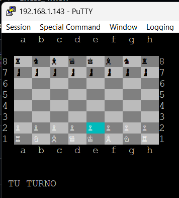

# ♚ MicroChess v1.0.0

Juego de ajedrez **MicroChess** para el procesador **6502** corriendo sobre el monitor para FPGA **Tang Nano 9K**, con display ANSI por UART y efectos de sonido generados por el chip **SID 6581**.



## ✨ Características

- 🧠 **Motor de ajedrez Minimax + Alpha-Beta**: 3 niveles de dificultad
- 🎵 **Audio SID 6581**: Efectos para mover, capturar, jaque, jaque mate, enroque y promocion
- ♔ **Piezas Unicode**: Glifos reales (♔♕♖♗♘♙♚♛♜♝♞♟) en terminales UTF-8
- 🎮 **Control con cursor**: WASD/Flechas + Enter para seleccionar
- 🔄 **Tablero volteable**: Tecla F para cambiar perspectiva
- ⚡ **Optimizado para 6502**: Codigo eficiente en C89 estricto compatible con CC65

## 🛠️ Especificaciones Técnicas

### Hardware Objetivo
- **CPU**: MOS 6502 @ 3.375MHz
- **Audio**: SID 6581 ($D400)
- **Plataforma**: Tang Nano 9K FPGA
- **Display**: Terminal ANSI compatible via UART (115200 baud)

### Software
- **Compilador**: CC65 (`cl65`)
- **Lenguaje**: C89 estricto + ensamblador (startup, audio)
- **Dependencias**: `romapi.h` (API de la ROM del monitor)

### Motor de Ajedrez
- Algoritmo: Minimax con poda Alpha-Beta
- Evaluacion: Material (P=100, N=320, B=330, R=500, Q=900, K=20000)
- Ordenacion de movimientos: MVV-LVA
- Profundidad: 1 (Facil), 2 (Medio), 3 (Dificil)
- Reglas completas: enroque, en passant, promocion, 50 movimientos

## 🎮 Controles

| Tecla | Accion |
|---|---|
| `WASD` / `Flechas` | Mover cursor |
| `Enter` / `Espacio` | Seleccionar / Mover |
| `Esc` | Cancelar seleccion |
| `F` | Voltear tablero |
| `N` | Nuevo juego |
| `Q` | Salir |

## 🎵 Efectos de Sonido SID

| Evento | Sonido |
|---|---|
| Mover pieza | Click de madera |
| Captura | Barrido + impacto |
| Jaque | Pitidos alternados |
| Jaque mate | Fanfarria descendente |
| Enroque | Doble click |
| Promocion | Arpegio ascendente |
| Movimiento ilegal | Zumbido |
| CPU pensando | Tono ambiente suave |

## 📋 Menus del Juego

1. **Dificultad**: [1] Facil / [2] Medio / [3] Dificil
2. **Color**: [1] Blancas / [2] Negras

## 🚀 Instalacion y Compilacion

### Requisitos
- [CC65](https://cc65.github.io/) compilador cruzado para 6502
- Conexion serial a la Tang Nano 9K

### Compilar
```bash
make
```

### Cargar en la Tang Nano 9K
```
LOAD chess.bin 0800
R 0800
```

### Limpiar
```bash
make clean
```

## 📁 Estructura del Proyecto

```
ajedres/
├── src/
│   ├── main.c          # Punto de entrada, menus, bucle principal
│   ├── startup.s       # Codigo de inicio (stack, BSS)
│   ├── chess.c         # Tablero, reglas, generacion de movimientos
│   ├── engine.c        # Motor CPU: minimax + alpha-beta
│   ├── render.c        # Renderizado ANSI Unicode
│   ├── input.c         # Captura de teclas (UART)
│   └── sid_audio.s     # Efectos de sonido SID 6581
├── include/
│   ├── romapi.h        # API de la ROM del monitor
│   ├── chess.h         # Tipos y constantes del juego
│   ├── engine.h        # API del motor de ajedrez
│   ├── render.h        # API de renderizado
│   ├── input.h         # API de entrada
│   └── sid_audio.h     # API de audio
├── config/
│   └── programa.cfg    # Configuracion del linker
├── makefile
└── README.md
```
